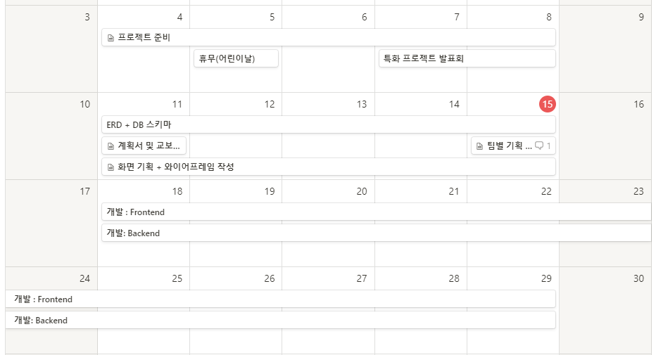
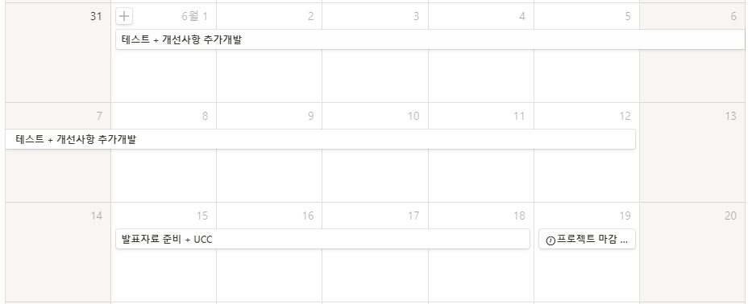

# 아로새김 Arosaegim [saegim.me](https://saegim.me)
   

> **아로새기다** [아로새기다] ( 활용형: 아로새김 )
>
> 1. 동사 무늬나 글자 따위를 또렷하고 정교하게 파서 새기다.
> 2. 동사 마음속에 또렷이 기억하여 두다.
> 3. 동사 뚜렷하게 기록하여 나타내다.
> 유의어 : 간직하다, 간수하다, 기억하다

[](https://youtu.be/7IQtZqChqbU)

_위 이미지를 클릭하면 영상을 볼 수 있습니다._

우리는 모두 잊지 않고 싶은 **순간** 을 만납니다. 그 숲의 향기, 그 날의 밤하늘, 그 곳의 분위기. 특별한 순간을 영원히 기억하고 싶은 우리를 위해 찰나를 새기듯이 기록할 수 있는 서비스 **아로새김** 입니다.

## 1. 아로새김 = 기억 + W3W + 카카오맵


**아로새김** 은 카카오맵과 W3W 주소 체계를 함께 사용하여 **지도상에 나만의 기억을 남길 수 있는 경험** 을 제공하는 서비스입니다. 

### 1.1 새김


아로새김은 사용자의 글 한 조각을 **새김** 이라고 부릅니다. 각 새김에는 고유한 W3W 주소가 함께 저장되고, 이는 지도 및 로드뷰 화면을 통해 볼 수 있습니다.

내 주변 새김을 읽거나 지도에 떠 있는 새김을 확인하여 마음에 드는 게시물은 **덧새김** 을 통해 공감을 표시하거나, **되새김** 을 통해 나의 생각을 남길 수 있습니다.

### 1.2 W3W


**W3W(what-three-words)** 는 우리가 흔히 사용하는 시-군-구-도로 등의 주소 체계를 벗어나 세 개 단어의 조합으로 위치를 표시하는 체계입니다.

현재 우리가 사용하는 주소 체계는 공간을 유일하게 식별하지 않습니다. 식별하더라도, 각 공간의 크기는 도로의 너비, 건물 또는 땅의 크기에 따라 매우 유동적입니다.

W3W는 이러한 점에서 시작한 서비스로, 3m x 3m로 지구상의 공간을 전부 나눈 후 각각의 공간에 **유일한 이름을 부여한 체계** 입니다. 각 이름은 세 개의 단어로 이루어져 있습니다. 부여된 이름은 주소가 바뀌어도 절대 바뀌지 않기 때문에, 해당 공간에 부여한 기록은 그대로 그 공간에 남게 됩니다.

무작위로 부여된 W3W 주소의 특성상, 지도를 조금만 옮겨도 전혀 다른 단어를 발견할 수 있습니다.

아로새김에서 새김을 작성하며 내 주변 아름다운 단어를 가진 주소를 발견하는 재미를 느낄 수 있습니다.

---

## 2. Getting Started

### 사용자

0. 아로새김이 정상 작동하지 않는다면 브라우저 설정에서 쿠키 및 사이트 데이터를 지워주셔야 합니다.
1. saegim.me에 접속합니다.
2. '홈 화면에 추가'를 통해 웹앱을 내려받습니다.

### 프론트엔드

**시작하기 전에**

아로새김은 아래와 같은 API를 사용합니다. 프로젝트를 사용하시려면 API 키를 발급받아야 합니다.

- what three words API [링크](https://developer.what3words.com/public-api)
- kakao maps API(web) [링크](https://apis.map.kakao.com/web/)

**환경 설정**

본 프로젝트를 실행하기 위해서는 `node.js` 및 아래에 명시된 라이브러리 등이 필요합니다. node 설치에 관한 내용은 다음 링크를 참고해주세요.

→ `node.js` | [v12.13.0](https://nodejs.org/ko/download/releases/) | [최신 버전](https://nodejs.org/ko/)

```
node.js             v12.13.0 or higher
npm                 v6.14.5  or higher
react               v16.13.1 or higher
material-ui         v4.9.14  or higher
styled-components   v5.1.0   or higher
```

또한 실행을 위해 필요한 환경 변수는 아래와 같습니다.

`.env`

```
REACT_APP_KAKAO_API=[your_api_key_here]
REACT_APP_W3W_API=[your_api_key_here]
REACT_APP_BASE_URL=http://localhost:8080/api
REACT_APP_BACK_URL=http://localhost:8080/api
```

**설치**

```bash
$ cd front/front-react
$ npm install
$ npm run start  # localhost:3000 또는 xxx.xxx.xxx.xxx:3000 접속
```

**빌드**

```
$ npm run build
```

### 백엔드 및 데이터베이스

**시작하기 전에**

아로새김의 백엔드는 java 1.8, mariaDB 10.4를 사용합니다.

**환경 설정**

---

## 3. Demo

[](https://youtu.be/Tn4FY9sjSQY)

_위 이미지를 클릭하면 영상을 볼 수 있습니다._

<table width="100%">
  <tr>
    <th>메인페이지</th>
    <th>리스트</th>
  </tr>
  <tr>
    <td>
      
    </td>
    <td>
      
    </td>
  </tr>
</table>

<table width="100%">
  <tr>
    <th>지도 뷰</th>
    <th>로드뷰</th>
  </tr>
  <tr>
    <td>
      
    </td>
    <td>
      
    </td>
  </tr>
</table>

<table width="100%">
  <tr>
    <th>필터 기능</th>
    <th>새김 작성</th>
  </tr>
  <tr>
    <td>
      
    </td>
    <td>
      
    </td>
  </tr>
</table>

<table width="100%">
  <tr>
    <th>마이페이지</th>
    <th>W3W 히스토리</th>
  </tr>
  <tr>
    <td>
      
    </td>
    <td>
      
    </td>
  </tr>
</table>

## 팀원
- 양찬우
- 최솔지 
- 김건호
- 김신재
- 전경윤

## 개발 일정

- 노션 링크 : https://www.notion.so/a7afc1c35e534bf9b67be69c7bdf0fd1?v=04e758783a644a8ead7f215c7485b8e3

  
  
